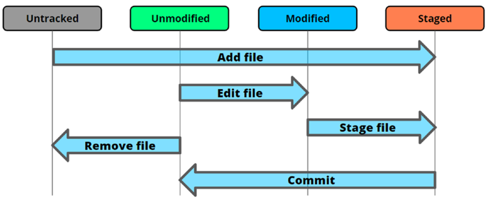

# GIT Reference


## Configuration

Git has 3 Configurations
1. System - this is system level for all users
   1. On WSL/Ubuntu it's `/etc/gitconfig`
   2. On Mac it's at `/private/etc/gitconfig`
   3. On Windows it's at `<GITROOT>\etc\gitconfig`
2. Global - This is for local logged in user
   1. On WSL/Ubuntu it's `/root/.gitconfig` or `~/.gitconfig`
   2. On Mac it's at `~/.gitconfig`
   3. On Windows it's at `%USERPROFILE%\.gitconfig`
3. Local - You have to be within a repo
   1. For all systems it will be at `.git/config`

```bash
#edit
git config --global --edit

git config --local --list

# Line Ending
#for Windows which has a CRLF ending use
git config --local core.autocrlf true
# for linux/mac which uses LF ending
git config --local core.autocrlf input

# Editor setup

git config --local diff.tool code
git config --local difftool.vscode.cmd "code --wait --diff $LOCAL $REMOTE"

```


## Setting up the repo

```
git init
git add README.md
git commit -m "first commit"
git branch -M main
git remote add origin git@github.com:23f2003570/git-experiments.git
git push -u origin main
```

## Remotes

```
➜  Notes git:(master) ✗ git remote show
origin

➜  Notes git:(master) ✗ git remote get-url origin
GITHUB-IITM:23f2003570/SC-Notes-IITM-BS-DS.git
```
## Branches

1. `HEAD` is a reference to the current branch

```bash
➜  Notes git:(main) ✗ git branch --all --list

# Creates 2 branches rm and ls
➜  Notes git:(main) ✗ git branch rm ls

➜  Notes git:(main) ✗ git branch --delete rm ls
Deleted branch rm (was 570626d).
Deleted branch ls (was 570626d).

# Move current branch (--force --move)
➜  Notes git:(main) ✗ git branch -M master

```

## Logs

```bash
➜  Notes git:(master) ✗ git log
commit 570626d35c5b28b80ded676eb07c39d11fe90df4 (HEAD -> master, origin/master)
Author: Adarsh K (ALIENWARE X17) <23f2003570@ds.study.iitm.ac.in>
Date:   Sat Dec 28 11:12:42 2024 +0530

    first commit of the SC Course and more..
(END)

# --decorate is to have Git annotate the commits with the relevant pointers.

# Online line commits in reverse
➜  Notes git:(master) ✗ git log --oneline --reverse
570626d (HEAD -> master, origin/master) first commit of the SC Course and more..
(END)
```


## Git Show

```bash
# Show the exact file contents in HEAD
➜  Notes git:(master) ✗ git show HEAD:"Git Reference.MD"

# Show the differences only.
➜  Notes git:(master) ✗ git show HEAD

# Show all files in the commit
➜  Notes git:(master) ✗ git ls-tree HEAD
100644 blob e3a08ff89eb470e5ac553fea58024303025f2748    Bash-Reference.MD
100644 blob 42903f607a8289f161a8ee5dcec325d55e5bc4f1    EMACS-Reference.MD
100644 blob 22faab626cea9cfef7f10b87668cc8349497ed0a    Git Reference.MD
040000 tree 58fea8ae876cd4583b9d4c47a06a10a4ef9b279f    Notes
100644 blob e69de29bb2d1d6434b8b29ae775ad8c2e48c5391    VIM-Reference.MD

# Show Files in a Directory
➜  Notes git:(master) ✗ git ls-tree HEAD:Notes
100644 blob a5b9fa78a8386f984fdcacf782476fdfb098075d    System Commands-Week01.MD

# Show a file in a commit
➜  Notes git:(master) ✗ git show 22faa
    -- contents of EMACS-Reference.MD in HEAD
```

### Objects in GIT
1. Commits
2. Blobs (Files)
3. Trees (Directories)
4. Tags

### GIT States



   - Unmodified: This file is identical in the workspace and in currently checked-out commit in the repository.
   - Modified: This file is present in both workspace and repository, but is different.
   - Staged: This file is in the workspace, current commit, and stage. Note that the file can be different in all three locations.
   - Untracked: This file is in the workspace, but not in the current commit.

### Git Notes

1. Base unit of GIT is the commit
2. Commit is the full state of the workspace at that point of time.
3. Git has 2 types of objects
   1. Objects
   2. References
      1. Branches
         1. Is like a tag, that moves
         2. Light weight. Maximum of 41 bytes (40 bytes of commit sha + 1 byte newline)
      2. Tags
         1. is a pointer to a commit
4. 